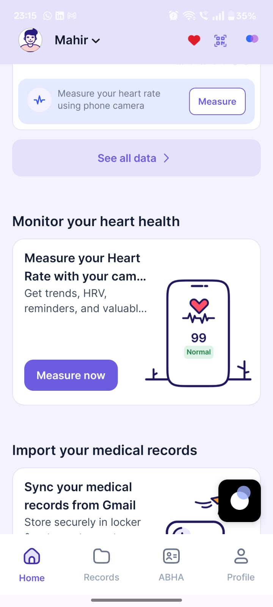
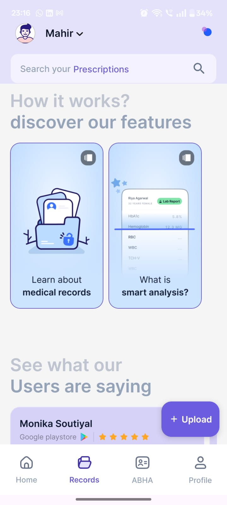
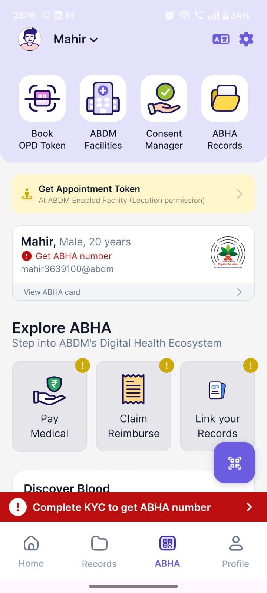
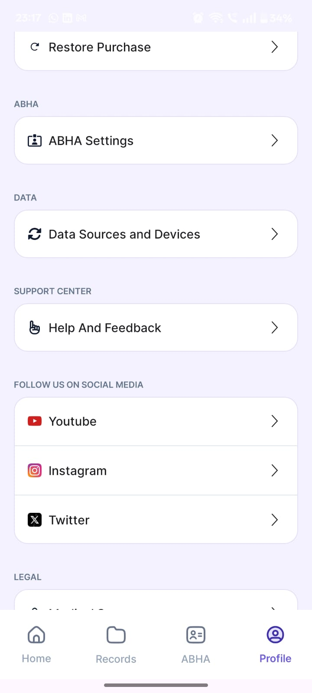

# 🏥 Swasthya Setu - Blockchain-Secured Vaccine Cold Chain & Rural Healthcare Platform

<div align="center">


**A comprehensive healthcare ecosystem ensuring vaccine integrity through IoT monitoring, blockchain verification, and AI-powered multilingual assistance for rural India**

[Features](#-features) • [Architecture](#-system-architecture) • [Installation](#-installation) • [Demo](#-demo-data) • [API Reference](#-api-reference) • [Contributing](#-contributing)

</div>

---

## 📋 Table of Contents

- [Overview](#-overview)
- [Problem Statement](#-problem-statement)
- [Solution](#-our-solution)
- [Features](#-features)
- [System Architecture](#-system-architecture)
- [Tech Stack](#-tech-stack)
- [Project Structure](#-project-structure)
- [Module Documentation](#-module-documentation)
  - [Doctor Dashboard](#-doctor-dashboard)
  - [Rural App](#-rural-app)
  - [Blockchain Module](#-blockchain-module)
- [Installation](#-installation)
- [Environment Variables](#-environment-variables)
- [API Reference](#-api-reference)
- [Data Models](#-data-models)
- [Blockchain Integration](#-blockchain-integration)
- [AI & Voice Pipeline](#-ai--voice-pipeline)
- [Security Improvements](#-security-improvements)
- [Demo Data](#-demo-data)
- [Screenshots](#-screenshots)
- [Team](#-team)
- [License](#-license)

---

## 🎯 Overview

**Swasthya Setu** (Health Bridge) is an end-to-end vaccine cold chain management and rural healthcare platform that combines:

- 🌡️ **Real-time IoT Monitoring** - Temperature, GPS, and tamper detection for vaccine shipments
- 🔗 **Blockchain Verification** - Immutable audit trail using Ethereum smart contracts
- 🗣️ **Multilingual AI Assistant** - Voice-enabled chatbot supporting 10+ Indian languages
- 📱 **Mobile-First Design** - Flutter app for citizens, React dashboard for healthcare workers
- 🏥 **Rural Healthcare Focus** - ABHA/Aadhaar integration for inclusive healthcare access

This repository contains three main deliverables:
- **Doctor Dashboard** - Real-time vaccination center management
- **Blockchain Module** - Cold-chain and traceability with IoT/ESP32 integration
- **Rural App** - Citizen-facing mobile application with backend APIs

---

## ❗ Problem Statement

India's vaccine distribution faces critical challenges:

1. **Cold Chain Failures** - 25% of vaccines are wasted due to temperature excursions
2. **Lack of Transparency** - No real-time visibility into vaccine shipment status
3. **Language Barriers** - Rural populations struggle with English-only healthcare apps
4. **Trust Deficit** - Citizens cannot verify if vaccines were stored properly
5. **Paper-Based Tracking** - Manual processes lead to delays and errors

---

## 💡 Our Solution

Swasthya Setu addresses these challenges through:

### 🌡️ IoT-Based Cold Chain Monitoring
- Real-time temperature monitoring (2-8°C compliant)
- GPS tracking for shipment routes
- Tamper detection (lid open, shock sensors)
- Automated alerts for violations

### 🔗 Blockchain-Anchored Verification
- Every violation event is hashed and recorded on Ethereum
- QR code scanning reveals complete shipment history
- Immutable proof of vaccine integrity
- SAFE/UNSAFE verdict for end consumers

### 🗣️ Multilingual AI Assistant
- Voice-enabled chatbot using Sarvam AI
- Supports Hindi, Marathi, Tamil, Telugu, Bengali, and more
- Natural language appointment booking
- Health queries and vaccine information

### 📱 Integrated Healthcare Ecosystem
- Citizen app for booking and verification
- Doctor dashboard for queue management
- Real-time sync between all platforms
- ABHA/Aadhaar-based identity verification

---

## ✨ Features

### For Citizens (Customer App)
| Feature | Description |
|---------|-------------|
| 🆔 **Aadhaar Verification** | KYC with automatic ABHA card generation |
| 📍 **Center Finder** | Interactive map with vaccination centers |
| 📅 **Appointment Booking** | Voice or text-based booking |
| 💬 **AI Chatbot** | Multilingual health assistant |
| 📊 **Health Records** | Vaccine history, vitals, insights |
| 🔐 **Secret Vault** | PIN-protected document storage |
| 👨‍👩‍👧 **Family Management** | Book for family members |
| 📜 **QR Verification** | Scan vial QR for authenticity |

### For Doctors (Dashboard)
| Feature | Description |
|---------|-------------|
| 📋 **Queue Management** | Real-time patient queue with status transitions (BOOKED → CHECKED_IN → VACCINATED → DISPOSED) |
| 💉 **Inventory Control** | Stock levels, batch tracking, low-stock alerts (< 20 doses), one-click reorder |
| 🚚 **Shipment Tracking** | Live shipment status with multi-checkpoint timeline visualization |
| 📱 **QR Scanning** | Vial verification before administration |
| 📈 **Analytics** | KPI cards, capacity gauge, real-time alert feed |
| 👨‍⚕️ **Multi-Doctor Support** | Switch between doctor profiles and centers |
| 👥 **Patient Registry** | Aggregated patient view with Aadhaar/ABHA status indicators |

### For IoT Dashboard
| Feature | Description |
|---------|-------------|
| 🌡️ **Live Telemetry** | Temperature, humidity, GPS |
| ⚠️ **Alert System** | Cold chain, tamper, geofence alerts |
| 📊 **Charts** | Historical temperature graphs |
| 🔗 **Blockchain Proof** | On-chain event verification |
| 🎮 **Simulation** | 4 demo scenarios for testing |

---

## 🏗️ System Architecture

```
┌─────────────────────────────────────────────────────────────────────────────┐
│                              SWASTHYA SETU ECOSYSTEM                        │
├─────────────────────────────────────────────────────────────────────────────┤
│                                                                             │
│  ┌─────────────┐     ┌─────────────┐     ┌─────────────┐                   │
│  │   Citizen   │     │   Doctor    │     │    IoT      │                   │
│  │  Flutter App│     │  Dashboard  │     │  Dashboard  │                   │
│  │  (Mobile)   │     │   (React)   │     │   (Web)     │                   │
│  └──────┬──────┘     └──────┬──────┘     └──────┬──────┘                   │
│         │                   │                   │                           │
│         └───────────────────┼───────────────────┘                           │
│                             │                                               │
│                             ▼                                               │
│              ┌──────────────────────────────┐                               │
│              │     Node.js Backend API      │                               │
│              │      (Express.js)            │                               │
│              ├──────────────────────────────┤                               │
│              │  Ports:                      │                               │
│              │  • 5001 - Doctor Dashboard   │                               │
│              │  • 5003 - Blockchain/IoT     │                               │
│              │  • 8000 - Rural Backend      │                               │
│              │  • 5002 - Demo Control       │                               │
│              └──────────────┬───────────────┘                               │
│                             │                                               │
│         ┌───────────────────┼───────────────────┐                           │
│         │                   │                   │                           │
│         ▼                   ▼                   ▼                           │
│  ┌─────────────┐     ┌─────────────┐     ┌─────────────┐                   │
│  │  MongoDB    │     │  Ethereum   │     │  Sarvam AI  │                   │
│  │  Database   │     │  Blockchain │     │  + Gemini   │                   │
│  └─────────────┘     └─────────────┘     └─────────────┘                   │
│                                                                             │
│  ┌─────────────────────────────────────────────────────────────────────────┤
│  │                        SERVICES                                         │
│  ├─────────────────────────────────────────────────────────────────────────┤
│  │  • Rule Engine - Cold chain, tamper, geofence violation detection       │
│  │  • Audit Chain - SHA256 hash chain for tamper-evident logs              │
│  │  • Blockchain Service - Ethereum event anchoring via VialLedger         │
│  │  • Simulator - 4 IoT demo scenarios (geofence breach, pressure anomaly) │
│  │  • Sarvam Service - STT/TTS/Translation for 10+ languages               │
│  └─────────────────────────────────────────────────────────────────────────┘
│                                                                             │
└─────────────────────────────────────────────────────────────────────────────┘
```

### Cross-App Data Flow

```
Rural App (Flutter)
       |
       v
Rural Server (Port 8000)
       |
       v
MongoDB: swasthsetu.appointments
       ^
       |
Doctor Dashboard (Port 5001) reads from the same collection
```

When a citizen books an appointment:
1. The request is sent to `POST /api/appointments`
2. The booking is written to MongoDB collection `appointments`
3. The doctor dashboard reads the same collection
4. The booking appears in the doctor queue

### IoT Data Flow

```
IoT Sensors / ESP32 → Telemetry API → Rule Engine → Violation Detection
                                           ↓
                                   Event Creation
                                           ↓
                       ┌───────────────────┼───────────────────┐
                       ↓                   ↓                   ↓
                 MongoDB              Audit Chain          Blockchain
                 (Store)              (Hash Chain)         (Immutable)
                                           ↓
                                   QR Verification
                                           ↓
                                   SAFE/UNSAFE Verdict
```

---

## 🛠️ Tech Stack

### Frontend
| Technology | Purpose |
|------------|---------|
| **Flutter** | Cross-platform mobile app (Customer) |
| **React 18 + Vite 7** | Doctor Dashboard & Admin Panel |
| **TypeScript 5.6** | Type-safe development |
| **TailwindCSS 3** | Styling framework |
| **shadcn/ui** | 46 Radix-based UI components |
| **Framer Motion** | Animations |
| **Wouter 3** | Lightweight routing (~1.5 kB) |
| **TanStack React Query 5** | Data fetching with staleTime 30s |
| **Recharts 2** | Charts and visualizations |
| **Mappls SDK** | Interactive maps for India |

### Backend
| Technology | Purpose |
|------------|---------|
| **Node.js 20** | Runtime environment |
| **Express 5 (ESM)** | REST API framework |
| **MongoDB** | Primary database |
| **Mongoose** | ODM for MongoDB |
| **bcryptjs** | Password hashing |
| **helmet** | HTTP security headers |
| **JWT** | Token-based authentication |

### Blockchain
| Technology | Purpose |
|------------|---------|
| **Ethereum** | Smart contract platform |
| **Solidity** | Smart contract language |
| **Hardhat** | Development framework |
| **ethers.js** | Ethereum library |

### AI & Voice
| Technology | Purpose |
|------------|---------|
| **Sarvam AI** | STT (Saarika v2), TTS (Bulbul v2), Translation (Mayura v1) |
| **Google Gemini** | LLM for contextual responses |
| **AI4Bharat** | IndicWav2Vec, IndicTrans2 (fallback) |

### DevOps
| Technology | Purpose |
|------------|---------|
| **Replit** | Cloud development & deployment |
| **Supabase** | Realtime database sync |
| **Firebase** | Push notifications |
| **esbuild** | Server bundling |

---

## 📁 Project Structure

```
Swasthya Setu/
├── doctor-dashboard/                # React Doctor Dashboard
│   ├── client/                      # Frontend (React + Vite)
│   │   ├── index.html               # Vite entry HTML
│   │   ├── public/                  # Static assets
│   │   └── src/
│   │       ├── main.tsx             # React entry point
│   │       ├── App.tsx              # Root component, routing, providers
│   │       ├── index.css            # Tailwind base styles
│   │       ├── components/
│   │       │   ├── ErrorBoundary.tsx
│   │       │   ├── app-sidebar.tsx  # Navigation sidebar
│   │       │   └── ui/              # 46 Shadcn/UI components
│   │       ├── contexts/
│   │       │   └── center-context.tsx
│   │       ├── hooks/
│   │       │   ├── use-mobile.tsx
│   │       │   └── use-toast.ts
│   │       ├── lib/
│   │       │   ├── queryClient.ts   # TanStack Query config
│   │       │   └── utils.ts         # cn() utility
│   │       └── pages/
│   │           ├── dashboard.tsx    # KPI overview
│   │           ├── appointments.tsx # Queue management
│   │           ├── patients.tsx     # Patient registry
│   │           ├── inventory.tsx    # Stock management
│   │           ├── shipments.tsx    # Shipment tracking
│   │           ├── qr-scan.tsx      # QR vial scanner
│   │           ├── analytics.tsx    # Charts and trends
│   │           ├── profile.tsx      # Doctor/center profile
│   │           ├── customer-app.tsx # Citizen booking portal
│   │           └── not-found.tsx    # 404 page
│   ├── server/
│   │   ├── index.ts                 # Express app, MongoDB connect
│   │   ├── routes.ts                # All API route handlers
│   │   ├── storage.ts               # Hybrid Mongo/in-memory storage
│   │   ├── static.ts                # Production static serving
│   │   └── vite.ts                  # Vite dev server integration
│   └── shared/
│       └── schema.ts                # Zod schemas + TypeScript types
│
├── blockchain/                      # Cold-chain & Traceability Module
│   ├── contracts/
│   │   └── VialLedger.sol           # Main smart contract
│   ├── scripts/                     # Hardhat deployment scripts
│   ├── hardhat.config.js            # Hardhat configuration
│   ├── server/                      # Telemetry API, vial lookup
│   ├── demo-control/                # Scenario launcher
│   ├── esp32_coldchain/             # Hardware sketch for ESP32
│   └── iot-dashboard/               # Static dashboard assets
│
├── rural-app/                       # Citizen-Facing Module
│   ├── flutter-app/                 # Android Flutter app
│   │   ├── lib/
│   │   │   ├── main.dart            # App entry point
│   │   │   ├── homePage.dart        # Home screen
│   │   │   ├── login_new.dart       # Authentication
│   │   │   ├── Qrpage.dart          # QR scanner
│   │   │   ├── quiz.dart            # Health quizzes
│   │   │   ├── screens/             # Screen components
│   │   │   ├── models/              # Data models
│   │   │   └── services/            # API services
│   │   ├── android/                 # Android platform files
│   │   ├── ios/                     # iOS platform files
│   │   └── assets/                  # Images, icons, ABI
│   └── server/                      # Node/Express backend
│       ├── Routes/
│       │   ├── api.js               # Shared API routes
│       │   ├── iot.js               # IoT telemetry routes
│       │   ├── chain.js             # Blockchain routes
│       │   └── ai.js                # AI/Chat routes
│       ├── services/
│       │   ├── ruleEngine.js        # Violation detection
│       │   ├── auditChain.js        # Hash chain audit
│       │   ├── blockchain.js        # Ethereum integration
│       │   ├── sarvam.js            # Sarvam AI service
│       │   └── simulator.js         # IoT simulation
│       ├── models/                  # Mongoose schemas
│       └── data/                    # Seed data
│
└── README.md                        # This file
```

---

## 📘 Module Documentation

### 🩺 Doctor Dashboard

Real-time vaccination center management dashboard for healthcare workers. Provides a single pane of glass over appointment queues, vaccine inventory, cold-chain shipments, patient records, analytics, and QR-based vial verification.

#### Doctor Dashboard Routes

| Route | Page Component | Description |
|-------|---------------|-------------|
| `/` | `Dashboard` | KPI cards, capacity gauge, alert feed, quick actions |
| `/appointments` | `AppointmentsPage` | Appointment queue with status transitions and filters |
| `/patients` | `PatientsPage` | Patient registry with Aadhaar/ABHA status |
| `/inventory` | `InventoryPage` | Vaccine stock levels, batch info, reorder button |
| `/shipments` | `ShipmentsPage` | Active shipments with checkpoint timeline |
| `/qr-scan` | `QrScanPage` | QR code scanner for vial verification |
| `/analytics` | `AnalyticsPage` | Charts, trends, and detailed KPI breakdowns |
| `/profile` | `ProfilePage` | Doctor/center profile and context switcher |
| `/citizen` | `CustomerAppPage` | Citizen self-service booking portal |

#### Multi-Doctor / Multi-Center Context
- Switch between 4 pre-configured doctors (Dr. Rajesh Sharma, Dr. Priya Mehta, Dr. Anand Kulkarni, Dr. Suman Gupta)
- Switch between 4 vaccination centers (PHC Andheri, PHC Bandra, CHC Dadar, UHC Kurla)
- All API calls dynamically scoped to the selected center ID

---

### 📱 Rural App

Citizen-facing Swasthya Setu module for rural users. Contains both the end-user mobile client and backend APIs supporting login, Aadhaar simulation, center lookup, and appointment booking.

#### Flutter App Features
- Login and citizen profile access
- Appointment booking UI
- Center discovery and map navigation
- Multilingual UX scaffolding
- Chatbot / voice-first interaction scaffold

#### Backend Features
- Aadhaar simulation and signup/login
- JWT token issuance for client sessions
- Booking write path to MongoDB
- Center and appointment APIs
- Blockchain-linked appointment event recording

#### Status Mapping

When the rural app creates or updates an appointment, the Doctor Dashboard maps statuses:

| Rural App Status | Doctor Dashboard Status |
|-----------------|------------------------|
| `PENDING` | `BOOKED` |
| `CONFIRMED` | `CHECKED_IN` |
| `COMPLETED` | `VACCINATED` |
| `CANCELLED` | `CANCELLED` |

---

### ⛓️ Blockchain Module

Cold-chain and traceability demo module. Intentionally separate from the rural booking and doctor operations flow.

#### Module Purpose
- Vial traceability
- Telemetry ingestion from IoT/ESP32
- Geofence and route-deviation evidence
- Cold-chain and tamper event recording
- Blockchain-backed proof anchoring
- QR-based vial inspection flow

#### Verified Runtime Status
- Blockchain telemetry server starts on port `5003`
- Demo-control starts on port `5002`
- `/api/ping` returns `{ ok: true }`
- Demo-control scenario listing returns 4 scenarios

#### Demo Flow
1. Start the telemetry server
2. Start demo-control
3. Select a scenario such as geofence breach or pressure anomaly
4. Run the scenario to populate telemetry and event records
5. Open vial tracking / QR view for the generated vial
6. Optionally replace the simulator with a live ESP32 sender

---

## 🚀 Installation

### Prerequisites

- Node.js 20+
- Flutter 3.7+ (for mobile app)
- MongoDB (local or Atlas)
- MetaMask wallet (for blockchain features)

### What Was Removed (GitHub-Safe Export)

This export intentionally excludes:
- Live `.env` files
- API keys
- Blockchain private keys
- Wallet-backed RPC configuration
- Firebase mobile config files
- Dialogflow/service-account credentials
- Local binaries, logs, and `node_modules`

### Doctor Dashboard Setup

```bash
# Navigate to Doctor Dashboard
cd doctor-dashboard

# Install dependencies
npm install

# Start in development mode (Vite HMR + Express on port 5001)
npm run dev

# Open in browser
# Doctor Dashboard: http://localhost:5001
# Citizen Portal:   http://localhost:5001/citizen
```

#### Production Build

```bash
# Build client (Vite) + server (esbuild)
npm run build

# Start production server
npm start
```

### Rural App Setup

#### Backend

```bash
cd rural-app/server
npm install
npm run seed -- --force
npm start
```

Default port: `8000`

#### Flutter App

```bash
cd rural-app/flutter-app
flutter pub get
flutter run
```

**Note:** The Flutter project needs a full modern Flutter migration. Known areas needing future work:
- Older packages such as `barcode_scan`, `share`, and `better_player`
- Remaining null-safety cleanup
- Broader widget modernization for newer Flutter releases

### Blockchain Setup

#### Hardhat Contracts

```bash
cd blockchain
npm install
npm run compile
# or: npx hardhat compile
```

#### Telemetry Server

```bash
cd blockchain/server
npm install
set PORT=5003 && npm start
```

#### Demo Control

```bash
cd blockchain/demo-control
npm install
set PORT=5002 && set BACKEND_URL=http://localhost:5003 && set DOCTOR_DISPLAY_URL=http://localhost:5001 && npm start
```

#### Deploy Smart Contract to Sepolia

```bash
cd blockchain
npx hardhat run scripts/deploy.js --network sepolia
```

### Manual Hardware Setup (ESP32)

Before flashing the ESP32, update in `esp32_coldchain/esp32_coldchain.ino`:
- Wi-Fi SSID
- Wi-Fi password
- Server IP / port target

---

## 🔐 Environment Variables

Each backend folder includes a `.env.example`. To run locally:
1. Copy `.env.example` to `.env`
2. Fill in your own keys and connection strings
3. Install dependencies
4. Run the project locally

### Doctor Dashboard (`doctor-dashboard/.env`)

| Variable | Default | Description |
|----------|---------|-------------|
| `PORT` | `5001` | Server port |
| `NODE_ENV` | `development` | `development` enables Vite HMR |
| `MONGO_URI` | `mongodb://127.0.0.1:27017/swasthsetu` | MongoDB connection string |
| `ALLOWED_ORIGINS` | `http://localhost:5001` | Comma-separated CORS allowlist |

### Rural Backend (`rural-app/server/.env`)

| Variable | Description |
|----------|-------------|
| `MONGODB_URI` | MongoDB connection string |
| `JWT_SECRET` | JWT signing secret |
| `ADMIN_API_KEY` | Protects admin/demo routes |
| `ETHEREUM_RPC_URL` | Optional blockchain RPC |
| `WALLET_PRIVATE_KEY` | Optional wallet settings |

### Blockchain Module (`blockchain/.env`)

| Variable | Description |
|----------|-------------|
| `ETHEREUM_RPC_URL` | `https://eth-sepolia.g.alchemy.com/v2/YOUR_API_KEY` |
| `WALLET_PRIVATE_KEY` | Your wallet private key |
| `VIAL_LEDGER_ADDRESS` | Deployed contract address |
| `ADMIN_API_KEY` | Admin secret for demo reset route |

### Flutter App Configuration

| File | Description |
|------|-------------|
| `flutter-app/lib/globals.dart` | Default backend: `http://10.0.2.2:8000` |
| `flutter-app/android/app/google-services.template.json` | Firebase config template |
| `flutter-app/ios/Runner/GoogleService-Info.template.plist` | iOS Firebase template |
| `flutter-app/assets/dialogflow_service_account.template.json` | Dialogflow service account |

### AI Services

| Variable | Description |
|----------|-------------|
| `SARVAM_API_KEY` | Sarvam AI (STT/TTS/Translation) |
| `AI_INTEGRATIONS_GEMINI_API_KEY` | Google Gemini |
| `HUGGINGFACE_API_KEY` | Fallback AI |
| `MAPPLS_KEY` | Mappls API for maps |

---

## 📡 API Reference

### Dashboard API

| Method | Endpoint | Description |
|--------|----------|-------------|
| GET | `/api/dashboard/:centerId` | Aggregated stats (KPIs, alerts, center info) |

### Appointments API

| Method | Endpoint | Description |
|--------|----------|-------------|
| GET | `/api/appointments` | List appointments. Query: `centerId`, `date` |
| POST | `/api/appointments` | Create a new appointment |
| PATCH | `/api/appointments/:id` | Update appointment status |

**Valid statuses:** `BOOKED`, `CHECKED_IN`, `VACCINATED`, `CANCELLED`, `DISPOSED`

### Inventory API

| Method | Endpoint | Description |
|--------|----------|-------------|
| GET | `/api/inventory` | List inventory items. Query: `centerId` |
| POST | `/api/inventory/reorder` | Create reorder (auto-generates shipment) |

**Reorder body:**
```json
{
  "centerId": "CEN-001",
  "manufacturer": "Serum Institute",
  "vaccineType": "Covishield",
  "quantity": 500
}
```

### Shipments API

| Method | Endpoint | Description |
|--------|----------|-------------|
| GET | `/api/shipments` | List shipments. Query: `centerId` |
| GET | `/api/shipments/:shipmentId` | Get single shipment with checkpoints |
| POST | `/api/sim/start` | Start transit simulation. Query: `shipmentId` |

### Centers API

| Method | Endpoint | Description |
|--------|----------|-------------|
| GET | `/api/centers` | List all centers with live open-slot counts |
| GET | `/api/centers/:centerId` | Get single center details |

### Alerts API

| Method | Endpoint | Description |
|--------|----------|-------------|
| GET | `/api/alerts` | Get computed alerts. Query: `centerId` |

**Alert types:** `low_stock` (red), `in_transit` (yellow), `arrived` (green), `capacity` (blue)

### QR Scanning API

| Method | Endpoint | Description |
|--------|----------|-------------|
| POST | `/api/qr/scan` | Validate QR payload (`SHIPMENT_ID|BATCH`) |

### Patients API

| Method | Endpoint | Description |
|--------|----------|-------------|
| GET | `/api/patients` | Aggregated patient list. Query: `centerId` |

### Citizen Portal API

| Method | Endpoint | Description |
|--------|----------|-------------|
| POST | `/api/customer/register` | Register citizen (Aadhaar + name + password) |
| POST | `/api/customer/login` | Authenticate citizen (bcrypt compare) |
| POST | `/api/customer/book` | Book vaccination slot |
| POST | `/api/customer/bookings` | List citizen's bookings (Aadhaar in body) |

### Aadhaar API

| Method | Endpoint | Description |
|--------|----------|-------------|
| POST | `/api/aadhaar/verify` | Verify Aadhaar and generate ABHA |
| GET | `/api/aadhaar/lookup/:id` | Auto-fetch Aadhaar details |

### AI & Voice API

| Method | Endpoint | Description |
|--------|----------|-------------|
| POST | `/api/ai/chat` | Multilingual chatbot |
| POST | `/api/voice/stt` | Speech to text |
| POST | `/api/voice/tts` | Text to speech |

### IoT Pipeline API (`/iot`)

| Method | Endpoint | Description |
|--------|----------|-------------|
| POST | `/iot/telemetry` | Ingest sensor data |
| GET | `/iot/shipment/:id/latest` | Current shipment state |
| GET | `/iot/shipment/:id/history` | Telemetry history |
| GET | `/iot/shipments` | All IoT shipments |

### Blockchain API (`/chain`)

| Method | Endpoint | Description |
|--------|----------|-------------|
| POST | `/chain/record` | Write event to Ethereum |
| GET | `/chain/status` | Connection status |
| GET | `/chain/verify/:shipmentId` | Get on-chain events |

### Simulation API

| Method | Endpoint | Description |
|--------|----------|-------------|
| POST | `/api/sim/start` | Start simulation scenario |
| POST | `/api/sim/stop` | Stop simulation |

---

## 📊 Data Models

All models are defined using Zod and shared between client and server.

### Appointment
```typescript
{
  id: string;                 // UUID
  appointmentId: string;      // "APT-000101"
  aadhaarId: string;          // Masked: "XXXX-XXXX-1234"
  patientName: string;
  phone: string;
  centerId: string;           // "CEN-001"
  centerName: string;
  slotTime: string;           // ISO 8601 with timezone
  vaccineType: string;        // "Covishield", "Covaxin", "Sputnik V"
  dose?: number;              // 1 or 2
  aadhaarVerified: boolean;
  abhaStatus: "verified" | "pending" | "not_registered";
  status: "BOOKED" | "CHECKED_IN" | "VACCINATED" | "CANCELLED" | "DISPOSED";
  source?: "doctor" | "customer";
  createdAt: string;
}
```

### InventoryItem
```typescript
{
  id: string;
  centerId: string;
  vaccineType: string;
  manufacturer: string;       // "Serum Institute", "Bharat Biotech", "Dr. Reddy's"
  quantity: number;
  batchNo: string;            // "BATCH-2026-007"
  expiryDate: string;         // "2026-12-31"
}
```

### Shipment
```typescript
{
  id: string;
  shipmentId: string;         // "SHIP-00045"
  manufacturer: string;
  batchNo: string;
  vaccineType: string;
  quantity: number;
  originName: string;
  originLat: number;
  originLng: number;
  destinationCenterId: string;
  destinationName: string;
  status: "CREATED" | "IN_TRANSIT" | "ARRIVED";
  currentCheckpoint: string;
  currentLat: number;
  currentLng: number;
  checkpoints: Checkpoint[];  // Ordered array of transit points
  lastUpdateTs: string;
}
```

### Center
```typescript
{
  centerId: string;           // "CEN-001"
  name: string;               // "PHC Andheri"
  lat: number;
  lng: number;
  address: string;
  openSlots: number;
  totalSlots: number;
  vaccinesAvailable: Record<string, number>;
}
```

### CustomerUser
```typescript
{
  id: string;
  aadhaarId: string;          // Full 12-digit Aadhaar
  name: string;
  phone?: string;
  password: string;           // bcrypt hash
  vaccinated: "YES" | "NO";
}
```

---

## ⛓️ Blockchain Integration

### VialLedger Smart Contract - Complete Source Code

The `VialLedger.sol` contract provides immutable storage for violation events on Ethereum:

```solidity
// SPDX-License-Identifier: MIT
pragma solidity ^0.8.19;

contract VialLedger {
    struct ViolationRecord {
        bytes32 eventHash;
        string eventType;
        uint256 timestamp;
        uint256 blockTs;
    }

    mapping(string => ViolationRecord[]) private shipmentViolations;

    event ViolationRecorded(
        string indexed shipmentId,
        bytes32 eventHash,
        string eventType,
        uint256 timestamp
    );

    function recordViolation(
        string calldata shipmentId,
        bytes32 eventHash,
        string calldata eventType,
        uint256 timestamp
    ) external {
        shipmentViolations[shipmentId].push(ViolationRecord({
            eventHash: eventHash,
            eventType: eventType,
            timestamp: timestamp,
            blockTs: block.timestamp
        }));

        emit ViolationRecorded(shipmentId, eventHash, eventType, timestamp);
    }

    function getViolationCount(string calldata shipmentId) external view returns (uint256) {
        return shipmentViolations[shipmentId].length;
    }

    function getViolation(string calldata shipmentId, uint256 index) external view returns (
        bytes32 eventHash,
        string memory eventType,
        uint256 timestamp,
        uint256 blockTs
    ) {
        ViolationRecord storage v = shipmentViolations[shipmentId][index];
        return (v.eventHash, v.eventType, v.timestamp, v.blockTs);
    }
}
```

### Smart Contract Functions

| Function | Purpose |
|----------|---------|
| `recordViolation()` | Records a new violation event with hash, type, and timestamp |
| `getViolationCount()` | Returns total number of violations for a shipment |
| `getViolation()` | Retrieves specific violation details by index |

### Event Types

| Event | Severity | Trigger |
|-------|----------|---------|
| `COLD_CHAIN_BREACH` | HIGH | Temperature outside 2-8°C |
| `TAMPER_LID_OPEN` | CRITICAL | Container lid opened |
| `TAMPER_SHOCK` | CRITICAL | Physical shock detected |
| `ROUTE_DEVIATION` | MEDIUM | GPS outside geofence |

### Verification Flow

```
1. Citizen scans QR code on vaccine vial
2. App sends shipmentId to /chain/verify/:shipmentId
3. Backend queries Ethereum for all events
4. Returns SAFE (no violations) or UNSAFE (violations found)
5. Detailed event history shown to user
```

---

## 🗣️ AI & Voice Pipeline

### Complete Multilingual Flow

```
User Speech (Hindi/Marathi/etc.)
        ↓
Sarvam STT (saarika:v2)
        ↓
Detect Language
        ↓
Translate to English (mayura:v1)
        ↓
Gemini 2.5 Flash (contextual response)
        ↓
Translate to User Language (mayura:v1)
        ↓
Sarvam TTS (bulbul:v2, voice: anushka)
        ↓
Audio Response
```

### Supported Languages

| Code | Language |
|------|----------|
| en | English |
| hi | Hindi |
| mr | Marathi |
| ta | Tamil |
| te | Telugu |
| bn | Bengali |
| gu | Gujarati |
| kn | Kannada |
| ml | Malayalam |
| pa | Punjabi |

### Chatbot Intents

| Intent | Action |
|--------|--------|
| `BOOK_APPOINTMENT` | Book vaccination slot |
| `CHECK_STATUS` | Check appointment status |
| `FIND_CENTER` | Find nearby centers |
| `VACCINE_INFO` | Information about vaccines |
| `CANCEL_APPOINTMENT` | Cancel existing booking |
| `HELP` | General assistance |

---

## 🔒 Security Improvements

### Security Changes (v2.0)

| Area | Before (v1) | After (v2) |
|------|-------------|------------|
| Password storage | Plaintext in memory | bcrypt hashing (cost factor 10) |
| Aadhaar transmission | In URL path params | POST body |
| CORS policy | Wildcard `*` | Environment-based allowlist |
| Error boundary | None (white screen) | React `ErrorBoundary` with reload |
| Query caching | `staleTime: Infinity` | `staleTime: 30_000`, `refetchOnWindowFocus: true` |
| Data persistence | In-memory Maps | Hybrid MongoDB + in-memory |
| Dead code | Drizzle/PostgreSQL, Supabase client | Removed |
| HTTP security headers | None | `helmet` middleware |
| Hardcoded center ID | `"CEN-001"` everywhere | Dynamic from `CenterContext` |
| Vite `server.fs` | Unrestricted | `strict: true`, deny dotfiles |

### Blockchain Module Security

- Wildcard CORS replaced with allowlisted local origins
- `helmet` enabled
- Rate limiting enabled
- `/api/demo-reset` protected with `x-admin-key`
- Vial lookup returns `usable: false` when validation cannot be performed

### Rural App Security

- Login returns JWT instead of insecure implicit session assumptions
- User-detail reads protected by bearer token auth
- `/database/getUser` is admin-gated
- `/api/demo-reset` is admin-gated
- OTP generation uses stronger random generation and TTL-backed storage
- Password hashing for stored users

---

## 🎮 Demo Data

### Test Credentials

| Type | Value | Details |
|------|-------|---------|
| **Aadhaar** | `9999-1111-2222` | Ravi Patil, DOB: 2004-01-05 |
| **Customer Login** | Aadhaar: `123456789012` | Password: `pass123` |
| **Default Shipment** | `SHIP-00045` | Serum Institute, Covishield |

### Demo Scenarios

| Scenario | Description |
|----------|-------------|
| **Normal** | Shipment with no violations |
| **Cold Breach** | Temperature exceeds 8°C |
| **Tamper + Deviation** | Lid opened + route deviation |
| **Geofence Breach** | GPS outside permitted area |
| **Pressure Anomaly** | Pressure sensor triggered |

### Seed Data

On startup, the storage layer seeds the following demo data:

- **4 Centers:** PHC Andheri (CEN-001), PHC Bandra (CEN-002), CHC Dadar (CEN-003), UHC Kurla (CEN-004)
- **7 Appointments:** Various statuses (BOOKED, CHECKED_IN, VACCINATED) at CEN-001
- **3 Inventory Items:** Covishield (120 doses), Covaxin (15 doses, triggers low-stock alert), Sputnik V (45 doses)
- **3 Shipments:** One IN_TRANSIT, one ARRIVED, one CREATED
- **1 Customer:** Pre-registered for citizen portal testing

### Vaccination Centers

- PHC Andheri (CEN-001)
- PHC Bandra (CEN-002)
- CHC Dadar (CEN-003)
- UHC Kurla (CEN-004)
- PHC Goregaon (CEN-003)
- PHC Mulund (CEN-004)
- PHC Powai (CEN-005)
- PHC Vikhroli (CEN-006)

---

## 📸 Screenshots

<div align="center">

### Citizen App - Home & Records


*Home screen with vaccination records, nearby centers, and ABHA verification status*

### User Profile


*User profile with settings, family management, and app preferences*

### ABHA Health ID Creation


*Aadhaar-based ABHA Health ID generation with verified digital card*

### Multilingual AI Chatbot


*Voice-enabled AI assistant supporting Hindi, Marathi, and 10+ Indian languages*

</div>

---

## 🏆 Hackathon

<div align="center">

### 🎯 ACM AfterMath Hackathon 2026

This project was built during the **ACM AfterMath Hackathon 2026**, demonstrating innovative solutions for healthcare challenges in rural India.

</div>

---

## 👥 Team

<div align="center">

### **Team: Bhartiya Java Party** 🇮🇳

</div>

| Member | Role |
|--------|------|
| **Mahir Kachwala** | Full Stack Developer & Team Lead |
| **Arnav Kadhe** | Backend Developer |
| **Atharv Kanase** | Frontend Developer |
| **Vedant Hande** | Blockchain & IoT Developer |

---

## ⚠️ Notes

- This repository is intended for GitHub upload
- It is **not guaranteed to run out-of-the-box** until the required local `.env` files and mobile credentials are supplied
- The original working folder remains outside this export
- Each backend folder includes a `.env.example` for reference

---

## 📄 License

This project is licensed under the MIT License - see the [LICENSE](LICENSE) file for details.

---

## 🙏 Acknowledgments

- **Sarvam AI** - For multilingual STT/TTS/Translation APIs
- **AI4Bharat** - For IndicWav2Vec and IndicTrans2 models
- **Replit** - For cloud development environment
- **Mappls** - For India-centric mapping solution

---

<div align="center">

**Made with ❤️ for Rural India**

[⬆ Back to Top](#-swasthya-setu---blockchain-secured-vaccine-cold-chain--rural-healthcare-platform)

</div>
