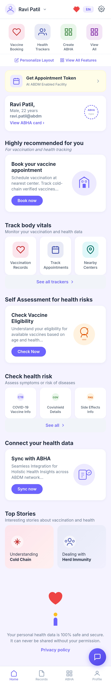
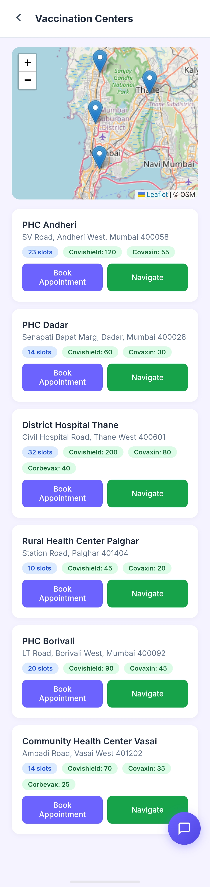
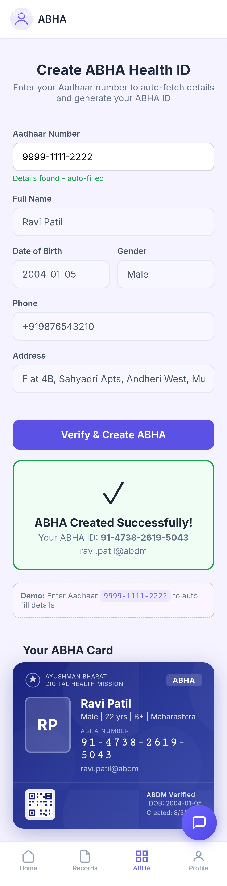
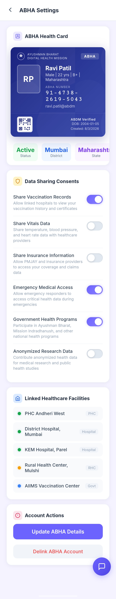
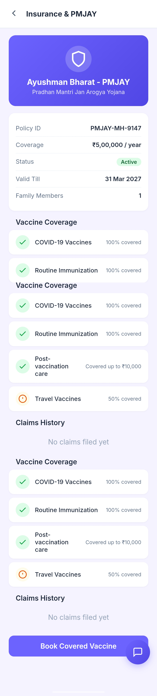
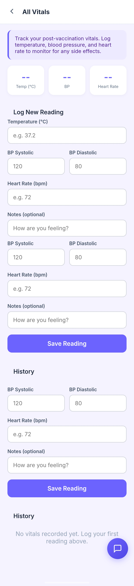

# 🏥 Swasthya Setu - Blockchain-Secured Vaccine Cold Chain & Rural Healthcare Platform

<div align="center">


**A comprehensive healthcare ecosystem ensuring vaccine integrity through IoT monitoring, blockchain verification, and AI-powered multilingual assistance for rural India**

[Features](#-features) • [Tech Stack](#-tech-stack) • [Installation](#-installation) • [API Reference](#-api-reference) • [Team](#-team)

</div>

---

## 📋 Table of Contents

- [Overview](#-overview)
- [Problem Statement](#-problem-statement)
- [Solution](#-our-solution)
- [Features](#-features)
- [Tech Stack](#-tech-stack)
- [Installation](#-installation)
- [Environment Variables](#-environment-variables)
- [API Reference](#-api-reference)
- [App Screenshots](#-app-screenshots)
- [Demo Data](#-demo-data)
- [Team](#-team)
- [License](#-license)

---

## 🎯 Overview

**Swasthya Setu** (Health Bridge) is an end-to-end vaccine cold chain management and rural healthcare platform that combines:

- 🌡️ **Real-time IoT Monitoring** - Temperature, GPS, and tamper detection for vaccine shipments
- 🔗 **Blockchain Verification** - Immutable audit trail using Ethereum smart contracts
- 🗣️ **Multilingual AI Assistant** - Voice-enabled chatbot supporting 10+ Indian languages
- 📱 **Mobile-First Design** - Flutter app for citizens, React dashboard for healthcare workers
- 🏥 **Rural Healthcare Focus** - ABHA/Aadhaar integration for inclusive healthcare access

**Three Main Modules:**
- **Doctor Dashboard** - Real-time vaccination center management
- **Blockchain Module** - Cold-chain and traceability with IoT/ESP32 integration
- **Rural App** - Citizen-facing mobile application with backend APIs

---

## ❗ Problem Statement

India's vaccine distribution faces critical challenges:

| Challenge | Impact |
|-----------|--------|
| **Cold Chain Failures** | 25% of vaccines wasted due to temperature excursions |
| **Lack of Transparency** | No real-time visibility into shipment status |
| **Language Barriers** | Rural populations struggle with English-only apps |
| **Trust Deficit** | Citizens cannot verify vaccine storage conditions |
| **Paper-Based Tracking** | Manual processes lead to delays and errors |

---

## 💡 Our Solution

| Solution | Description |
|----------|-------------|
| 🌡️ **IoT Cold Chain** | Real-time temperature monitoring (2-8°C), GPS tracking, tamper detection, automated alerts |
| 🔗 **Blockchain Verification** | Every violation hashed on Ethereum, QR code reveals history, SAFE/UNSAFE verdict |
| 🗣️ **Multilingual AI** | Voice chatbot via Sarvam AI, supports 10+ Indian languages, natural language booking |
| 📱 **Integrated Ecosystem** | Citizen app + Doctor dashboard + Real-time sync + ABHA/Aadhaar verification |

---

## ✨ Features

### For Citizens (Mobile App)
| Feature | Description |
|---------|-------------|
| 🆔 **Aadhaar Verification** | KYC with automatic ABHA card generation |
| 📍 **Center Finder** | Interactive map with vaccination centers |
| 📅 **Appointment Booking** | Voice or text-based booking |
| 💬 **AI Chatbot** | Multilingual health assistant |
| 📊 **Health Records** | Vaccine history, vitals, insights |
| 🔐 **Secret Vault** | PIN-protected document storage |
| 👨‍👩‍👧 **Family Management** | Book for family members |
| 📜 **QR Verification** | Scan vial QR for authenticity |

### For Doctors (Dashboard)
| Feature | Description |
|---------|-------------|
| 📋 **Queue Management** | Real-time patient queue (BOOKED → CHECKED_IN → VACCINATED → DISPOSED) |
| 💉 **Inventory Control** | Stock levels, batch tracking, low-stock alerts, one-click reorder |
| 🚚 **Shipment Tracking** | Live status with multi-checkpoint timeline |
| 📱 **QR Scanning** | Vial verification before administration |
| 📈 **Analytics** | KPI cards, capacity gauge, real-time alerts |
| 👥 **Patient Registry** | Aggregated view with Aadhaar/ABHA status |

### For IoT Dashboard
| Feature | Description |
|---------|-------------|
| 🌡️ **Live Telemetry** | Temperature, humidity, GPS |
| ⚠️ **Alert System** | Cold chain, tamper, geofence alerts |
| 🔗 **Blockchain Proof** | On-chain event verification |

---

## 🛠️ Tech Stack

| Layer | Technologies |
|-------|--------------|
| **Frontend** | Flutter (Mobile), React 18 + Vite, TypeScript, TailwindCSS, shadcn/ui |
| **Backend** | Node.js 20, Express 5, MongoDB, Mongoose, JWT |
| **Blockchain** | Ethereum, Solidity, Hardhat, ethers.js |
| **AI & Voice** | Sarvam AI (STT/TTS), Google Gemini, AI4Bharat |
| **Maps** | Mappls SDK (India-centric) |

---
---

## 🏗️ Architecture Diagram

<div align="center">

[](https://github.com/mahirkachwala/swasthya-setu-platform/blob/main/architechture-diagram.png)

</div>

### Architecture Overview

The **Swasthya Setu platform** follows a modular multi-layer architecture designed for scalable and transparent healthcare infrastructure.

| Layer | Components | Role |
|------|-------------|------|
| **Citizen Layer** | Flutter Mobile App | Allows citizens to register, book appointments, access health records, and interact with AI chatbot |
| **Doctor Layer** | React Dashboard | Enables healthcare workers to manage queues, inventory, shipments, and vaccination records |
| **Backend Layer** | Node.js, Express, MongoDB | Handles API requests, authentication, and system data management |
| **Blockchain Layer** | Ethereum Smart Contracts | Stores immutable records of cold-chain violations and shipment traceability |
| **IoT Layer** | ESP32 Sensors, Telemetry Server | Collects temperature, GPS, and tamper data from vaccine shipments |
| **AI Layer** | Sarvam AI, Gemini | Provides multilingual chatbot and voice assistance |

---

## 🚀 Installation

### Prerequisites
- Node.js 20+
- Flutter 3.7+ (for mobile app)
- MongoDB (local or Atlas)
- MetaMask wallet (for blockchain features)

### Doctor Dashboard
```bash
cd doctor-dashboard
npm install
npm run dev
# Open http://localhost:5001
```

### Rural App Backend
```bash
cd rural-app/server
npm install
npm run seed -- --force
npm start
# Runs on port 8000
```

### Flutter App
```bash
cd rural-app/flutter-app
flutter pub get
flutter run
```

### Blockchain Module
```bash
cd blockchain
npm install
npm run compile

# Start Telemetry Server (port 5003)
cd blockchain/server && npm install && npm start

# Deploy to Sepolia
npx hardhat run scripts/deploy.js --network sepolia
```

---

## 🔐 Environment Variables

Each backend folder includes a `.env.example`. Copy to `.env` and configure:

| Module | Key Variables |
|--------|---------------|
| **Doctor Dashboard** | `PORT`, `MONGO_URI`, `ALLOWED_ORIGINS` |
| **Rural Backend** | `MONGODB_URI`, `JWT_SECRET`, `ADMIN_API_KEY` |
| **Blockchain** | `ETHEREUM_RPC_URL`, `WALLET_PRIVATE_KEY`, `VIAL_LEDGER_ADDRESS` |
| **AI Services** | `SARVAM_API_KEY`, `AI_INTEGRATIONS_GEMINI_API_KEY` |

---

## 📡 API Reference

### Core APIs
| Endpoint | Method | Description |
|----------|--------|-------------|
| `/api/appointments` | GET/POST/PATCH | Manage appointments |
| `/api/inventory` | GET | List inventory items |
| `/api/inventory/reorder` | POST | Create reorder |
| `/api/shipments` | GET | List/track shipments |
| `/api/centers` | GET | List vaccination centers |
| `/api/qr/scan` | POST | Validate QR payload |

### Citizen Portal
| Endpoint | Method | Description |
|----------|--------|-------------|
| `/api/customer/register` | POST | Register citizen |
| `/api/customer/login` | POST | Authenticate |
| `/api/customer/book` | POST | Book slot |
| `/api/aadhaar/verify` | POST | Verify Aadhaar + generate ABHA |

### AI & Voice
| Endpoint | Method | Description |
|----------|--------|-------------|
| `/api/ai/chat` | POST | Multilingual chatbot |
| `/api/voice/stt` | POST | Speech to text |
| `/api/voice/tts` | POST | Text to speech |

### Blockchain
| Endpoint | Method | Description |
|----------|--------|-------------|
| `/chain/record` | POST | Write event to Ethereum |
| `/chain/verify/:shipmentId` | GET | Get on-chain events |
| `/iot/telemetry` | POST | Ingest sensor data |

---

## 📸 App Screenshots

<div align="center">

### Citizen App

<table>
<tr>
<td align="center">
<b>Home</b><br>
<a href="https://github.com/mahirkachwala/swasthya-setu-platform/blob/main/home.jpg">

</a>
</td>

<td align="center">
<b>Main Home</b><br>
<a href="https://github.com/mahirkachwala/swasthya-setu-platform/blob/main/main-home.jpg">

</a>
</td>

<td align="center">
<b>Navigation</b><br>
<a href="https://github.com/mahirkachwala/swasthya-setu-platform/blob/main/navigation-center.jpg">

</a>
</td>
</tr>

<tr>
<td align="center">
<b>ABHA Card</b><br>
<a href="https://github.com/mahirkachwala/swasthya-setu-platform/blob/main/abha-card.jpg">

</a>
</td>

<td align="center">
<b>ABHA Setup</b><br>
<a href="https://github.com/mahirkachwala/swasthya-setu-platform/blob/main/abha-setting.jpg">

</a>
</td>

<td align="center">
<b>Insurance</b><br>
<a href="https://github.com/mahirkachwala/swasthya-setu-platform/blob/main/insurance.jpg">

</a>
</td>
</tr>

<tr>
<td align="center">
<b>Appointment</b><br>
<a href="https://github.com/mahirkachwala/swasthya-setu-platform/blob/main/appointment-booked.jpg">

</a>
</td>

<td align="center">
<b>Manual Appointment</b><br>
<a href="https://github.com/mahirkachwala/swasthya-setu-platform/blob/main/manual-appointment.jpg">

</a>
</td>

<td align="center">
<b>Family</b><br>
<a href="https://github.com/mahirkachwala/swasthya-setu-platform/blob/main/family.jpg">

</a>
</td>
</tr>

<tr>
<td align="center">
<b>Chatbot 1</b><br>
<a href="https://github.com/mahirkachwala/swasthya-setu-platform/blob/main/chat1.jpg">

</a>
</td>

<td align="center">
<b>Chatbot 2</b><br>
<a href="https://github.com/mahirkachwala/swasthya-setu-platform/blob/main/chat2.jpg">

</a>
</td>

<td align="center">
<b>Chatbot 3</b><br>
<a href="https://github.com/mahirkachwala/swasthya-setu-platform/blob/main/chat3.jpg">

</a>
</td>
</tr>

<tr>
<td align="center">
<b>Vault</b><br>
<a href="https://github.com/mahirkachwala/swasthya-setu-platform/blob/main/vault.jpg">

</a>
</td>

<td align="center">
<b>Vault Inside</b><br>
<a href="https://github.com/mahirkachwala/swasthya-setu-platform/blob/main/vault-inside.jpg">

</a>
</td>

<td align="center">
<b>Vitals</b><br>
<a href="https://github.com/mahirkachwala/swasthya-setu-platform/blob/main/vitals.jpg">

</a>
</td>
</tr>

<tr>
<td align="center">
<b>Help & Feedback</b><br>
<a href="https://github.com/mahirkachwala/swasthya-setu-platform/blob/main/help.jpg">

</a>
</td>
</tr>

</table>

</div>

---

## 🎮 Demo Data

### Test Credentials
| Type | Value | Details |
|------|-------|---------|
| **Aadhaar** | `9999-1111-2222` | Ravi Patil, DOB: 2004-01-05 |
| **Customer Login** | Aadhaar: `123456789012` | Password: `pass123` |
| **Default Shipment** | `SHIP-00045` | Serum Institute, Covishield |

### Demo Scenarios
| Scenario | Description |
|----------|-------------|
| **Normal** | Shipment with no violations |
| **Cold Breach** | Temperature exceeds 8°C |
| **Tamper + Deviation** | Lid opened + route deviation |
| **Geofence Breach** | GPS outside permitted area |

### Vaccination Centers
PHC Andheri, PHC Bandra, CHC Dadar, UHC Kurla, PHC Goregaon, PHC Mulund, PHC Powai, PHC Vikhroli

---

## 👥 Team

<div align="center">

### **Team: Code Of Duty** 🇮🇳

</div>

| Member | Role |
|--------|------|
| **Mahir Kachwala** | Full Stack Developer |
| **Arnav Kadhe** |  Blockchain & IoT Developer |
| **Atharv Kanase** | Frontend Developer |

---

## 📄 License

This project is licensed under the MIT License - see the [LICENSE](LICENSE) file for details.

---

## 🙏 Acknowledgments

- **Sarvam AI** - For multilingual STT/TTS/Translation APIs
- **AI4Bharat** - For IndicWav2Vec and IndicTrans2 models
- **Mappls** - For India-centric mapping solution

---

<div align="center">

**Made with ❤️ for Rural India**

[⬆ Back to Top](#-swasthya-setu---blockchain-secured-vaccine-cold-chain--rural-healthcare-platform)

</div>
